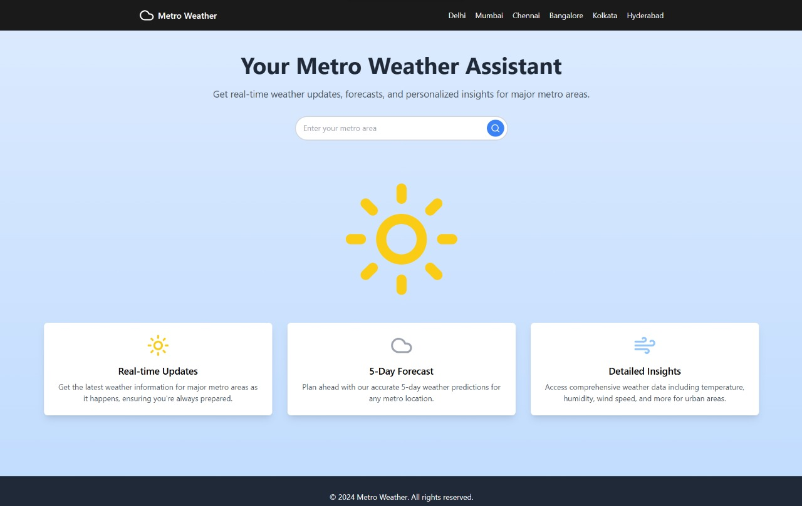
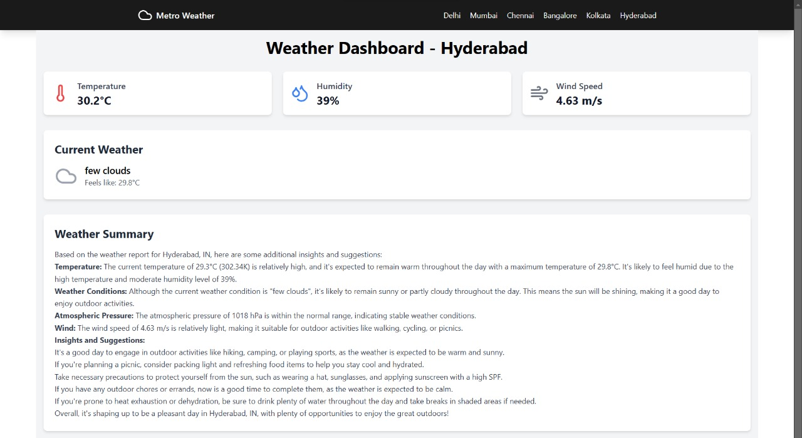
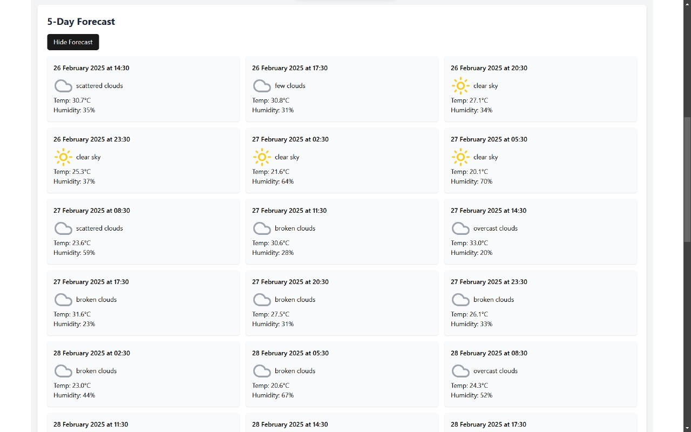

# 🌤️ MetroWeather

MetroWeather is a simple and elegant weather application that provides users with current weather conditions, a detailed day summary, and a 5-day forecast. Users can search for and select their preferred location to get updated weather information using the OpenWeather API.

---
## 🔗 Live Preview

You can try out MetroWeather in this live demo: https://metro-weather.netlify.app/

## ✨ Features
- **Current Weather** 🌡️: Real-time weather data, including temperature, humidity, and wind speed.
- **Daily Summary** 📝: Concise summary of the current day's weather conditions.
- **5-Day Forecast** 📅: Weather outlook for the next five days.
- **Search by Location** 🔍: Enter a city name or use location services.
- **Responsive UI** 📱: Works smoothly on various screen sizes.

---

## 🛠️ Tech Stack
- **Frontend**: Vite, React, JSX, CSS 🎨
- **Backend**: Express.js, Node.js 🚀
- **API**: OpenWeather API ☁️
- **Version Control**: Git and GitHub 🗃️

---

## 🖼️ Sample Images

### 📊 Dashboard
 

### ☀️ Daily Summary
 

### 📅 5-Day Forecast
 

---

## 📁 Project Structure
```
MetroWeather/
│
├── frontend/              # Frontend (Vite + React)
│   ├── public/           # Public assets
│   ├── src/              # Source files
│   │   ├── components/   # React components
│   │   ├── pages/        # Main pages for routing
│   │   ├── services/     # API service logic
│   │   ├── App.js        # Main App file
│   │   └── index.js      # Entry point
│   └── package.json      # Frontend dependencies
│
├── backend/              # Backend (Express.js)
│   ├── routes/           # API routes
│   ├── controllers/      # API logic
│   ├── server.js         # Server setup
│   └── package.json      # Backend dependencies
│
└── README.md             # Project documentation
```

---

## ⚙️ Installation

### 🔹 Frontend Setup (Vite + React)
```bash
# Navigate to the frontend folder
cd frontend

# Install dependencies
npm install

# Create a .env file and add your OpenCage API key
VITE_API_KEY=your-api-key-here

# Start the development server
npm run dev
```

### 🔹 Backend Setup (Express.js)
```bash
# Navigate to the backend folder
cd backend

# Install dependencies
npm install

# Create a .env file and add your OpenWeather API key
API_KEY=your-api-key-here
MONGODB_CLIENT=your-mongodb-connection-string-here

# Start the backend server
npm start
```

---

## 🌐 API Details
The app uses the *OpenWeather API* to fetch real-time weather information.

### Example API Call:
```javascript
fetch(`https://api.openweathermap.org/data/2.5/weather?q={city name}&appid={API key}`);
```

---

## 🚀 Future Enhancements
- **Hourly Forecast** ⏳: Display hourly weather data.
- **Weather Alerts** ⚠️: Notify users of extreme weather conditions.
- **Theme Customization** 🎨: Light and dark mode options.
- **Localization** 🌍: Support multiple languages.

---

## 🤝 Contributing
Contributions are welcome! Follow these steps to contribute:
1. **Fork the repository**.
2. **Create a new branch**: `git checkout -b feature/YourFeatureName`.
3. **Make your changes and commit**: `git commit -m 'Add some feature'`.
4. **Push to the branch**: `git push origin feature/YourFeatureName`.
5. **Open a pull request**.

### 🔦 **Happy Coding!** 🔦
